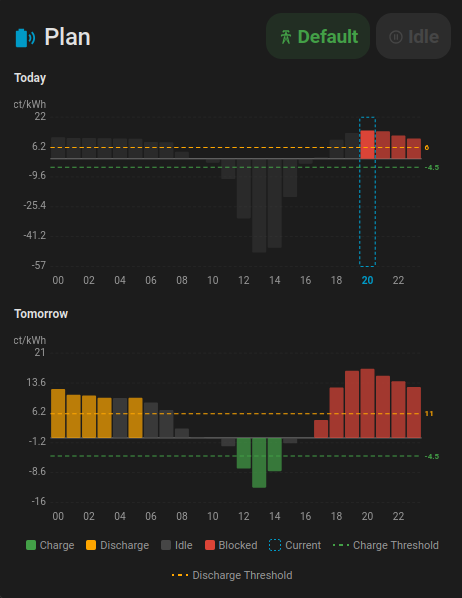

# Victron Charge Controller Card

A custom [Home Assistant](https://www.home-assistant.io/) Lovelace dashboard card for controlling and monitoring a Victron ESS system via the [Victron Charge Controller](https://github.com/johannesWen/Victron-Charge-Controller) integration.

| Settings Card | Plan Card |
|:---:|:---:| 
| <a href="assets/screenshots/settings_card.png"></a> | <a href="assets/screenshots/settings_card.png"></a> |


## Features

- **Mode selection** — Switch between Off, Auto, Manual, Force Charge, and Force Discharge
- **Charge / Discharge control** — Toggle charging and discharging, adjust power setpoints
- **Battery limits** — Set minimum and maximum SOC
- **Grid settings** — Configure idle, min, and max grid setpoints
- **Auto mode tuning** — Cheapest/expensive hours, price thresholds for charge and discharge
- **Grid feed-in control** — Enable/disable feed-in, set price threshold and power limits
- **Blocked hours** — Visual hour-chip grid to block charging or discharging during specific hours
- **Action buttons** — Recalculate schedule or clear the current schedule
- **Visual editor** — Configure the card title and entity prefix directly from the Lovelace UI

## Prerequisites

This card requires the **Victron Charge Controller** custom integration to be installed and configured in Home Assistant:

[https://github.com/johannesWen/Victron-Charge-Controller](https://github.com/johannesWen/Victron-Charge-Controller)

## Installation

### HACS (recommended)

1. Open **HACS** in Home Assistant
2. Go to **Frontend** → click the three-dot menu → **Custom repositories**
3. Add `https://github.com/johannesWen/Victron-Charge-Controller-Dashboard` with category **Dashboard**
4. Search for **Victron Charge Controller Card** and install it
5. Reload your browser

### Manual

1. Download `victron-charge-controller-card.js` from the [latest release](https://github.com/johannesWen/Victron-Charge-Controller-Dashboard/releases)
2. Copy it to your Home Assistant `config/www/` directory
3. Add the resource in **Settings → Dashboards → Resources** (or in your Lovelace YAML config):

   ```yaml
   resources:
     - url: /local/victron-charge-controller-card.js
       type: module
   ```

4. Reload your browser

## Configuration

Add the card to your dashboard via the UI editor or YAML.

### UI Editor

1. Edit your dashboard → **Add Card** → search for **Victron Charge Controller**
2. Configure the title and entity prefix in the visual editor

### YAML

```yaml
type: custom:victron-charge-controller-card
title: Victron Charge Control
entity_prefix: victron_charge_control
```

| Option          | Type   | Default                    | Description                                        |
| --------------- | ------ | -------------------------- | -------------------------------------------------- |
| `title`         | string | `Victron Charge Control`   | Card title displayed in the header                 |
| `entity_prefix` | string | `victron_charge_control`   | Common prefix of all entity IDs from the integration |

## Development

### Building from source

```bash
# Install dependencies
npm install

# Build the bundled card
npm run build

# Watch for changes during development
npm run watch

# Run the live development server
npm run serve
```

The output is written to `dist/victron-charge-controller-card.js`.

### Testing in Home Assistant (Docker)

A `docker-compose.yml` is included that spins up a full Home Assistant instance with the card and the backend integration pre-loaded, along with dummy sensors so no real hardware is needed.

```bash
# 1. Build the card
npm run build

# 2. Start the dev container
docker compose up -d

# 3. Open Home Assistant
#    http://localhost:8123
```

On first launch, complete the HA onboarding wizard. The Lovelace dashboard at **Overview** will already contain the card and helper controls to adjust dummy sensor values (Battery SOC, Grid Setpoint, EPEX Spot Price).

To iterate on the card, rebuild with `npm run build` and hard-refresh the browser (`Ctrl+Shift+R`).

Stop the container with:

```bash
docker compose down
```

## License

This project is licensed under the [MIT License](LICENSE).